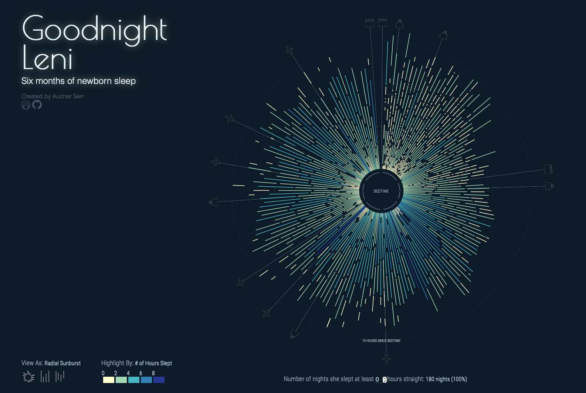

# Goodnight Leni

Data Visualization project tracking the first six months of newborn sleep.

See the [full project here](https://projects.aucherserr.com/goodnight-leni/).

Built with [Sveltekit](https://kit.svelte.dev) using [D3](https://github.com/d3/d3/wiki).

Data collected using [Huckleberry](https://huckleberrycare.com).

---

## Acknowledgements

Thanks for Ofer Chen, Ellie Frymire, and Katrin Bichler for their design eye and encouragement.

Thanks to Leni for... being born and sleeping (sometimes).
